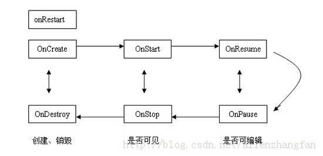
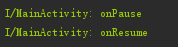

# Android开发艺术探索
图书勘误地址:[《Android开发艺术探索》图书勘误 - 任玉刚 - CSDN博客]( http://blog.csdn.net/singwhatiwanna/article/details/48439621)

## 番外话
* 不知不觉都已经踏入2018年的2月了,任玉刚先生的《Android开发艺术探索》都已经上市很久了，之前一直都以为最新的新书(比如《Android高级进阶》或者《Android进阶之光》)书籍会比它好,所以一直都没有阅读该书,但招聘碰壁以来,我就感觉自己too young too simple,这本书确实很好,很值得迷茫的初级程序员拜读
* 这笔记不仅主要为了春招而准备的,但我也为了构建Android知识体系
* 这里每一章都会出现"推荐阅读"的优质文章推荐,推荐的文章不仅仅是技术,更有生活以及职场相关的好文章,毕竟我们的目标是做一位程序员,而不是coder...
* 这里每一章都会存在基础知识博客的引入,毕竟我做这个笔记也是为了系统知识的构建而不仅仅是为了应付春招

对本笔记有存疑点或者建议的朋友们可Email我:3421448373@qq.com(杨晓)

## Android的生命周期和启动模式

### 推荐阅读-推荐的不仅仅是技术
* [干货：史上最全广州租房攻略(收藏) ](https://mp.weixin.qq.com/s/NYjd1VWQPwjstRnYav94yg)
* [经典：如何变成一个有趣的男人？](https://mp.weixin.qq.com/s/Y56ml4ib1rpDda-u3RL7Cg)
* [面试失败率高达100%，该怎么破？](https://mp.weixin.qq.com/s/PmmUup4qN5mfoIkpXDjWXQ)
* [编程的自学方法](http://mp.weixin.qq.com/s/dsBoZHfsb97owCKiQVIF6g)


### 1.1 Activity的生命周期全面分析
| Activity的生命周期 | Activity典型情况 | Activity异常情况 |
| :------------: |:-----------:| :-----:|
| 形成原因 | 有用户参与的情况下,Activity所经过的生命周期的改变 | Activity被系统回收或者由于当前设备的Configuration而发生改变从而导致的Activity被销毁重建 |



|  Activity生命周期图解析 | | |
| :------------: |:-----------:| :-----:|
| onCreate()| onDestroy() | 创建和销毁 |
| onStart() | onStop() | 可见和不可见 |
| onResume()  | onPause()  | 获取焦点和失去焦点(可编辑和不可编辑)  |


#### 关于Activity生命周期的基础篇:
* [1.1、Activity的生命周期 - CSDN博客]( http://blog.csdn.net/lonelyroamer/article/details/8927940)
* [深入理解Activity的生命周期 - 简书]( https://www.jianshu.com/p/fb44584daee3)
* [Android中Activity数据的保存和恢复 - 简书](https://www.jianshu.com/p/6622434511f7)
 * 这篇文章翻译关于onSaveInstanceState()调用的话语实在看不懂:
  > Android calls onSaveInstanceState() before the activity becomes vulnerable   to being destroyed by the system, but does not bother calling it when the instance is actually being destroyed by a user action (such as pressing the BACK key)
  >
  > 其实就是系统去销毁它会调用onSaveInstanceState(),但如果是主动调用比如主动点击返回键销毁的话就不会调用onSaveInstanceState()

  * 系统只会在Activity异常终止的时候才会调用onSaveInstanceState()和onRestoreInstanceState()来存储和恢复数据,其他情况不会触发这个过程

* [Android-Activity所应该了解的大概就这样。（上） - 简书]( https://www.jianshu.com/p/33d0a0abd990)


### 1.2 Activity的启动模式

#### 关于Activity生命周期的基础篇:
* 关于Activity的launchMode的基础介绍:[【Android归纳】Activity启动模式 - s003603u的专栏 - CSDN博客]( http://blog.csdn.net/s003603u/article/details/47056379)
* [Android中Activity四种启动模式和taskAffinity属性详解 - CSDN博客](http://blog.csdn.net/zhangjg_blog/article/details/1092364)

#### 探究
* 书中提及“如果一个以singleTop模式启动的activity的实例已经存在于任务桟的桟顶，那么再启动这个Activity时，不会创建新的实例，而是重用位于栈顶的那个实例”,但它会走什么生命周期方法呢？
```
startActivity(new Intent(MainActivity.this, MainActivity.class));//这里MainActivity为singleTop模式启动
```

 

 如图所示,Activity还是会走 onPause->onResume 的


#### 书中存疑点
* 关于书中P15提及,类似[使用ApplicationContext启动standard模式的Activity报错原因解析 - haohengyuan的专栏 - CSDN博客]( http://blog.csdn.net/haohengyuan/article/details/51898448):
>当我们使用ApplicationContext去启动 standard模式的Activity的时候会报错：
Calling startActivity() from outside of an Activity context requires the FLAG_ACTIVITY_NEW_TASK flag. Is this really what you want?

 但很好奇的是我在Intent的第一个参数传入ApplicationContext没有报错,如下代码:
 ```
 //SecondActivity的启动模式为standard
 Intent intent = new Intent(getApplicationContext(), SecondActivity.class);
getApplicationContext().startActivity(intent);
 ```
经过我机型测试,发现5.0以下的会存在这个问题,但7.0之后的机型都不会存在这个问题

### 书中补充点
* startActivityForResult和启动模式
  startActivityForResult方法能够起效：standard和singleTop
  startActivityForResult方法不能够起效：singleTas和singleInstance
  * 只要将被启动的Activity属性设置为singleTask则一定不起效
  * 只要将被启动的Activity属性设置为singleInstance则一定不起效
  * 只要将启动的Activity模式设置为singleInstance则不论被启动的Activity为什么模式均不起效
* taskAffinity
  * [android android:taskAffinity 详解 - CSDN博客]( http://blog.csdn.net/dblackde/article/details/7608255)
  * [Android Application Task Activities的关系 - 蝈蝈俊 - 博客园](http://www.cnblogs.com/ghj1976/archive/2011/04/29/2032412.html)


## 写作工具
* 之前在CSDN博客以及博客园上写作,但GitHub平台对markdown语法支持以及渲染非常好,所以决定弃暗投明,拥抱GitHub怀抱,在寻找markdown的写作工具的时候,我用过很多,最后还是选择了GitHub出品的Atom以及微软的VS Code
 * Atom不翻墙全局代理的话可以看这个教程:[ATOM插件安装详细教程 - 简书 ](https://www.jianshu.com/p/b4e80ed3a304)
* 看了那么多博客,最好看的还是私人博客的排版等好看,毕竟一种米养百种人,每个人可以根据同一个技术平台制作出自己喜欢的写作风格,说了那么多其实就是建议你自搭博客平台
 * [2018，你该搭建自己的博客了！ | Ryan's Blog](http://ryane.top/2018/01/10/2018%EF%BC%8C%E4%BD%A0%E8%AF%A5%E6%90%AD%E5%BB%BA%E8%87%AA%E5%B7%B1%E7%9A%84%E5%8D%9A%E5%AE%A2%E4%BA%86%EF%BC%81/)
 * [关于HEXO搭建个人博客的点点滴滴 - 掘金](https://juejin.im/post/5a6ee00ef265da3e4b770ac1)
