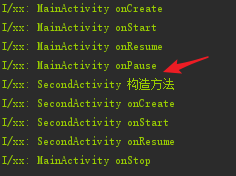

# Android 面经基础篇


## 番外话
* 本教程是基于[《Android第一行代码》](./Android第一行代码/Android第一行代码Note.md)的目录而制作的


### 第2章 先从看的到的入手-探究Activity
* [1.1、Activity的生命周期 - CSDN博客]( http://blog.csdn.net/lonelyroamer/article/details/8927940)
* [深入理解Activity的生命周期 - 简书]( https://www.jianshu.com/p/fb44584daee3)
* [Android中Activity数据的保存和恢复 - 简书]( https://www.jianshu.com/p/6622434511f7)
* [Android-Activity所应该了解的大概就这样。（上） - 简书 ](https://www.jianshu.com/p/33d0a0abd990)

#### 笔记补充
关于Activity跳转时发生的生命周期，我在想着前一个Activity先Pause还是后一个Activity的构造方法先走，于是做了下面的实验：

1.SecondActivity
```
public class SecondActivity extends AppCompatActivity {

    public SecondActivity() {
        Log.i("xx", TAG + " 构造方法");
    }

    @Override
    protected void onCreate(Bundle savedInstanceState) {
        super.onCreate(savedInstanceState);
        setContentView(R.layout.activity_second);

        Log.i("xx", TAG + " onCreate");
    }
    ...//其他生命周期都是类似onCreate()这样写的
}
```

2.之后MainActivity的点击事件跳转到SecondActivity
```
 startActivity(new Intent(this, SecondActivity.class));
```



从图中可以看出,前一个Activity先Pause，后一个Activity的构造方法才走
